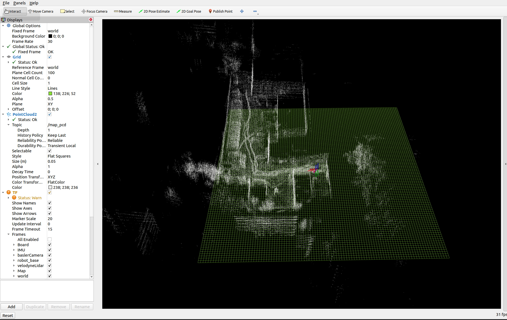

# localization_ros

This Ros2 package is for localization using point to plane ICP integrated with IMU measurements to accelerate ICP convergence. The package works with the ROS2 bags (.db3) recorded by AKULA robot and the map produced by LOAM. 

The package is fully in python and it provides visualization in RVis. The robot state is provided through a tf2 transform form frame ```'robot_base' ``` to frame ```'Map' ```

to use the package: 
1. clone the package folder to your ROS2 workspace: 
```
git clone git@gitlab.navigine.com:navigine/localization_ros.git
```
- your ```src``` directory should look like this: 
```
.
├── localization
│   ├── config
│   │   ├── config.rviz
│   │   └── params.yaml
│   ├── launch
│   │   └── loc.launch.py
│   ├── localization
│   │   ├── fixed_frames.py
│   │   ├── icp_loc.py
│   │   ├── __init__.py
│   │   ├── map_pub.py
│   │   ├── robot_tfs.py
│   │   └── tools.py
│   ├── package.xml
│   ├── resource
│   │   ├── localization
│   │   └── map.pcd
│   ├── setup.cfg
│   ├── setup.py
│   └── test
│       ├── test_copyright.py
│       ├── test_flake8.py
│       └── test_pep257.py
└── README.md

6 directories, 18 files
```

2. build the package and source you workspace: 
```
cd ~ <your/workspace/dir>
colcon build 
. install/setup.bash
```
3. Launch and use the localization node: 
```
ros2 launch localization loc.launch.py
```
you will get: 

now in a seprate terminal play your ROS2 bag: 

```
ros2 bag play <ros2_bag_name.db3>
```
to run the node in diffrent map change the ```map.pcd``` file in ```resource``` directory. 

##### There are some map examples from the car recorded data in the ```resource``` directory


## Installing ROS2

current version intalled [Ros2 foxy](https://docs.ros.org/en/foxy/)
